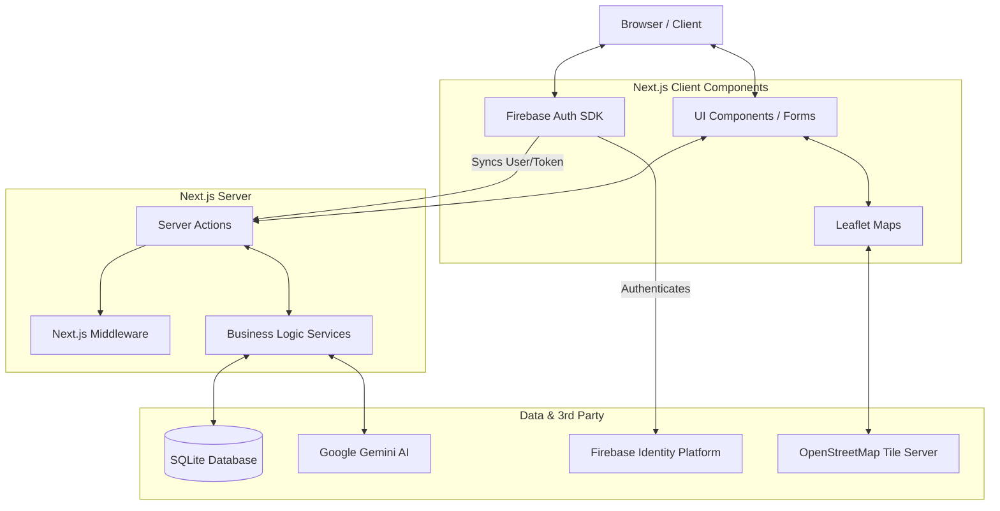

# RE Manager OS - Architecture and Technical Specifications

## 1. System Overview

**RE Manager OS** is a premium, multi-tenant Software-as-a-Service (SaaS) platform designed for luxury real estate organizations. It provides a comprehensive suite of tools to manage real estate projects, properties, and associated documents. The system leverages AI for intelligent document processing and offers local-first mapping solutions for property visualization.

### Key Features:
- **Multi-tenant Architecture:** Organizations are isolated by slug (`/dashboard/[orgSlug]`), allowing users to belong to and manage different organizations.
- **Client-Side Authentication:** Lightweight authentication using Firebase Client SDK, synchronized with a local database for session management via secure HTTP-only cookies.
- **AI-Powered Document Analysis:** Automated summarization of legal and real estate documents (PDFs) using Google's Gemini AI.
- **Interactive Mapping:** Local-first, highly customizable property mapping using Leaflet and OpenStreetMap (bypassing the need for paid Google Maps API keys).
- **Luxury UI/UX:** A modern, responsive, and polished interface built with Next.js App Router, Tailwind CSS, and shadcn/ui components.

---

## 2. Technology Stack

### Frontend
- **Framework:** Next.js 14.2.15 (App Router)
- **UI Library:** React 18.3
- **Styling:** Tailwind CSS, PostCSS
- **Components:** shadcn/ui, Radix UI (via `@base-ui/react`), Lucide Icons
- **State Management:** Zustand
- **Data Fetching/Mutations:** Next.js Server Actions, React Hook Form, Zod (Validations)
- **Maps:** Leaflet, React Leaflet

### Backend & Data Layer
- **API/Server:** Next.js Server Actions and Route Handlers
- **Database:** SQLite (local-first approach, easily migratable)
- **ORM:** Drizzle ORM (`drizzle-orm`, `drizzle-kit`)
- **Authentication:** Firebase Auth (Client-side) + JWT (jose) for Next.js middleware sessions
- **AI Integration:** Google Generative AI SDK (`@google/generative-ai`), PDF parsing (`pdf-parse`)

### Development & Tooling
- **Language:** TypeScript
- **Package Manager:** pnpm (inferred from `pnpm-lock.yaml`)
- **Linting:** ESLint

---

## 3. System Architecture

The application follows a modern serverless-friendly architecture leveraging Next.js App Router.

### Component Breakdown
1. **Frontend Layer:** Built with React Server Components (RSC) where possible for performance, using Client Components for interactive elements (maps, forms, auth state).
2. **Authentication Flow:** User logs in via Firebase on the client. A server action (`syncUserSession`) is called to sync the user profile to the SQLite database and generate a custom JWT cookie. Next.js Middleware uses this cookie to protect `/dashboard` routes.
3. **Server Actions (`src/actions`):** Act as the API layer, handling form submissions and data mutations directly from Server and Client components.
4. **Service Layer (`src/services`):** Encapsulates business logic and database queries using Drizzle ORM. Separates concerns from the presentation layer.
5. **Database (`src/lib/db`):** Uses Better-SQLite3 for high-performance, local data storage.

---

## 4. Data Model & Schema

The database is managed via Drizzle ORM. The core entities and relationships are:

- **Users:** Core identity (`users`). Mapped 1:1 with Firebase UID.
- **Organizations:** Represents a tenant or company (`organizations`). Identified by a unique `slug`.
- **Memberships:** Join table defining the Many-to-Many relationship between Users and Organizations, including Role Based Access Control (RBAC) roles (e.g., `OWNER`, `VIEWER`).
- **Projects:** Groupings of properties within an organization (`projects`).
- **Properties:** Individual real estate assets (`properties`). Belongs to a Project. Contains location (lat/lng) and pricing data.
- **Documents:** Files associated with a Property (`documents`). Stores file URLs, types, and AI-generated summaries.
- **Audit Logs:** Tracks actions performed within the system for security and compliance (`audit_logs`).

---

## 5. Key Modules and Workflows

### 5.1 Multi-tenant Routing
The application utilizes Next.js dynamic routes to handle multi-tenancy: `/dashboard/[orgSlug]/*`.
When a user accesses a tenant route, the `layout.tsx` verifies their session and membership to the organization via the `slug`. If unauthorized, they are redirected.

### 5.2 Map Integration (Leaflet)
Google Maps was replaced with Leaflet and OpenStreetMap for a free, highly customizable, local-first solution.
- **Utilities (`src/lib/maps/map-utils.ts`):** Provides premium tile layer configurations (e.g., CARTO Voyager) and fixes Next.js SSR issues with Leaflet marker icons.
- Maps visualize `latitude` and `longitude` data stored in the `properties` and `projects` tables.

### 5.3 AI Document Processing
When a user uploads a PDF document (e.g., a Sale Deed):
1. The file is saved locally to the `public/uploads/{propertyId}` directory.
2. A database record is created.
3. If the file is a PDF, `pdf-parse` extracts the text content.
4. The text is sent to Google's Gemini 1.5 Flash model via the `processPdfSummary` service, prompting it to act as a Real Estate legal assistant to extract key parties, clauses, and a summary.
5. The summary is saved back to the document record in the database.

---

## 6. Security & Privacy

- **Authentication:** Firebase handles credential security. The app relies on secure, HTTP-only, SameSite=Lax cookies for session management to mitigate XSS attacks.
- **Authorization:** Handled at the database query level in the Service layer (e.g., `getProjectById` always verifies the `organizationId`).
- **Data Protection:** SQLite database (`dev.db`/`sqlite.db`) should be excluded from version control (`.gitignore`) and properly backed up in production scenarios.

---

## 7. Deployment Considerations

While currently configured for local development using SQLite, the architecture is designed for easy migration to a cloud environment.

1. **Environment Variables:** Require setup for Firebase, Gemini AI, database URL, and JWT secrets (`.env.local`).
2. **Database Migration:** Drizzle ORM allows for a relatively straightforward migration from SQLite to PostgreSQL (e.g., Neon, Supabase) by changing the database driver and updating the schema definitions when moving to a serverless cloud provider like Vercel.
3. **File Storage:** Local uploads (`public/uploads`) should be migrated to cloud storage (e.g., AWS S3, Firebase Storage) for a scalable production deployment.

---

## 8. Future Roadmap

- **Cloud Migration:** Transition SQLite to PostgreSQL and local file storage to AWS S3.
- **Enhanced RBAC:** Implement fine-grained permissions for roles like `SALES_MANAGER` and `LEGAL_MANAGER`.
- **Advanced AI Agents:** Expand Gemini integration to include conversational querying of property documents.
- **Billing Integration:** Add Stripe for SaaS subscription management.
